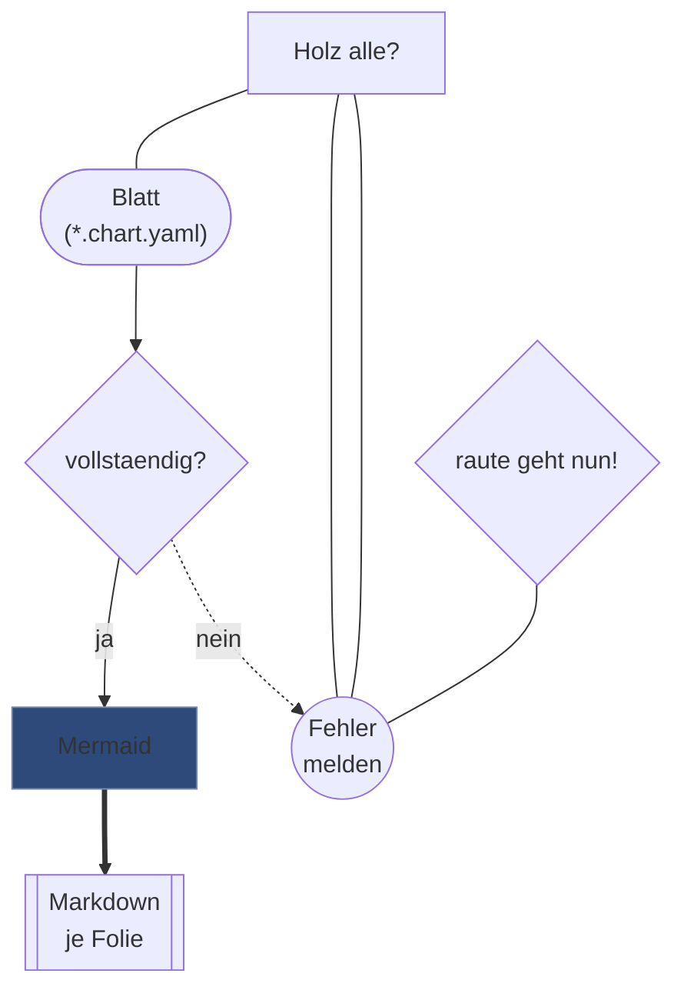

# Zeichnung wird Mermaid

```mermaid
flowchart TD
    n1(["Blatt<br/>(*.chart.yaml)"])
    n2{"vollstaendig?"}
    n3["Mermaid"]
    n4(("Fehler<br/>melden"))
    n5[["Markdown<br/>je Folie"]]
    n6["Holz alle?"]
    n10{"raute geht nun!"}
    n1 --> n2
    n2 -->|"ja"| n3
    n2 -.->|"nein"| n4
    n3 ==> n5
    n6 --- n4
    n6 --- n4
    n6 --- n1
    n10 --- n4
    style n3 fill:#2e4a7a,stroke:#7788aa
```
